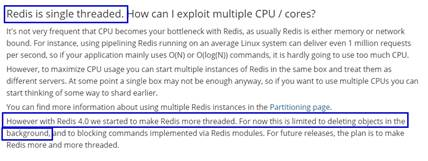

大厂高阶班之 Redis专题 尚硅谷讲师:周阳 2021.5V1.7

\1.   本课程前置要求说明..................................................................................................... 3

1.1.   本课程学生对象.................................................................................................... 3

1.1.1.    已经学完尚硅谷零基础就业班的6个月的学习............................................. 3

·   什么是Redis..................................................................................................... 3

·   Redis能干嘛..................................................................................................... 4

·   五大数据类型..................................................................................................... 4

·   。。。。。。..................................................................................................... 4

1.1.2.    And最好........................................................................................................ 4

1.1.3.    实际工作过1~3年的Java开发工程师......................................................... 4

1.2.   本课程的难度对标................................................................................................. 4

1.2.1.    阿里P6---P7.................................................................................................. 4

1.2.2.    大厂面试题走起看看...................................................................................... 4

\2.    redis官网查阅和基本配置........................................................................................... 4

2.1.   英文....................................................................................................................... 4

2.1.1.    https://redis.io/............................................................................................... 4

2.2.   中文....................................................................................................................... 4

2.2.1.    http://redis.cn/................................................................................................ 4

2.3.   redis安装(不讲解)................................................................................................. 4

2.3.1.    https://redis.io/download............................................................................... 4

2.4.   官网命令大全网址................................................................................................. 5

2.4.1.    http://www.redis.cn/commands.html............................................................. 5

2.4.2.    http://doc.redisfans.com/............................................................................... 5

2.5.   安全Bug按照官网提示，升级成为6.0.8............................................................. 5

2.6.   查看自己redis版本的命令................................................................................... 6

2.6.1............................................................................................................................. 6

2.7.   redis配置文件初始............................................................................................... 6

\3.    redis单线程 VS 多线程(入门篇)................................................................................. 7

3.1.   首课重要，后续深度讲解，避免晕菜................................................................... 7

3.2.   Redis为什么选择单线程？................................................................................... 7

3.2.1.    是什么............................................................................................................ 7

3.2.2.    redis之父的发言............................................................................................ 8

·   http://antirez.com/news/132.............................................................................. 8

3.2.3.    why................................................................................................................ 8

·   **厘清⼀个事实我们通常说， Redis是单线程究竟何意？**................................. 8

·   请说说演进变化情况？...................................................................................... 9

·   Redis3.x单线程时代但性能依旧很快的主要原因......................................... 9

·   基于内存操作：Redis 的所有数据都存在内存中，因此所有的运算都是内存级别的，所以他的性能比较高；........................................................................................................... 9

·   数据结构简单：Redis 的数据结构是专门设计的，而这些简单的数据结构的查找和操作的时间大部分复杂度都是 O(1)，因此性能比较高；......................................................... 9

·   多路复用和非阻塞 I/O：Redis使用 I/O多路复用功能来监听多个 socket连接客户端，这样就可以使用一个线程连接来处理多个请求，减少线程切换带来的开销，同时也避免了 I/O 阻塞操作 9

·   避免上下文切换：因为是单线程模型，因此就避免了不必要的上下文切换和多线程竞争，这就省去了多线程切换带来的时间和性能上的消耗，而且单线程不会导致死锁问题的发生   9

·   作者原话........................................................................................................ 9

·   https://redis.io/topics/faq............................................................................... 9

·   Redis 4.0之前一直采用单线程的主要原因有以下三个............................... 10

3.3.    既然单线程这么好，为什么逐渐又加入了多线程特性？................................... 10

3.3.1.    单线程也有单线程的苦恼............................................................................. 10

·   举个栗子.......................................................................................................... 11

3.3.2.    如何解决...................................................................................................... 11

·   使用惰性删除可以有效的避免 Redis 卡顿的问题.......................................... 11

·   案例................................................................................................................. 11

·   在Redis 4.0就引入了多个线程来实现数据的异步惰性删除等功能， 但是其处理读写请求的仍然只有一个线程，所以仍然算是狭义上的单线程。...................................................... 12

3.4.    redis6的多线程和IO多路复用**入门篇**.............................................................. 12

3.4.1.    对于Redis主要的性能瓶颈是内存或者网络带宽而并非 CPU。................ 12

3.4.2.    最后Redis的瓶颈可以初步定为：网络IO.................................................. 13

·   redis6，真正多线程登场................................................................................. 13

3.4.3.    Unix网络编程中的五种IO模型.................................................................. 13

·   Blocking IO - 阻塞IO...................................................................................... 13

·   NoneBlocking IO - 非阻塞IO.......................................................................... 13

·   IO multiplexing - IO多路复用.......................................................................... 13

·   signal driven IO - 信号驱动IO........................................................................ 13

·   asynchronous IO - 异步IO............................................................................. 13

3.4.4.    第一次听...................................................................................................... 13

·   听不懂没关系，阳哥故意的，先混个耳熟，后续大招先给我预热.................. 13

3.4.5.    简单说明...................................................................................................... 13

·   Redis工作线程是单线程的， 但是， 整个Redis来说，是多线程的；........ 14

·   上述说明.......................................................................................................... 14

·   结论................................................................................................................. 14

3.5.    Redis6.0默认是否开启了多线程？................................................................... 15

3.6.    我还是曾经那个少年.......................................................................................... 16

\4.    springboot+redis+mybatis案例基础 与一键编码环境整合....................................... 16

4.1.    2021.5.11第一次详细手写主要业务逻辑代码，以后直接copy........................ 16

4.2.    TK Mapper......................................................................................................... 16

4.2.1.    MyBatis 通用 Mapper4官网....................................................................... 16

·   https://github.com/abel533/Mapper................................................................ 17

4.2.2.    mybatis-generator....................................................................................... 17

·   http://mybatis.org/generator/........................................................................... 17

4.2.3.    一键生成...................................................................................................... 17

·   db2021库t_user用户表SQL......................................................................... 17

·   建springboot的Module.................................................................................. 17

·   mybatis_generator................................................................................... 18

·   改POM............................................................................................................ 18

·   写YML............................................................................................................. 22

·   无................................................................................................................. 22

·   mgb配置相关src\main\resources路径下新建............................................... 22

·   config.properties.......................................................................................... 22

·   内容.............................................................................................................. 22

·   generatorConfig.xml.................................................................................... 23

·   内容.............................................................................................................. 23

·   一键生成.......................................................................................................... 24

·   双击插件mybatis-generator:gererate，一键生成 生成entity+mapper接口+xml实现SQL 24

4.3.    案例实战总01：SpringBoot + Mybatis + Redis(重写Redis的序列化)的缓存实战 25

4.3.1.    建Module.................................................................................................... 25

·   redis_20210511............................................................................................ 25

4.3.2.    改POM........................................................................................................ 25

4.3.3.    写YML......................................................................................................... 30

4.3.4.    主启动.......................................................................................................... 32

4.3.5.    后续下一次课见........................................................................................... 33

 

\1.    本课程前置要求说明

 

|      |                                         |
| ---- | --------------------------------------- |
|      |  |

1.1.    本课程学生对象

1.1.1.    已经学完尚硅谷零基础就业班的6个月的学习

·     什么是Redis

 

|      |                                         |
| ---- | --------------------------------------- |
|      |  |

·     Redis能干嘛

 

|      |                                         |
| ---- | --------------------------------------- |
|      |  |

·     五大数据类型

 

|      |                                         |
| ---- | --------------------------------------- |
|      |  |

·     。。。。。。

1.1.2.    And最好

1.1.3.    实际工作过1~3年的Java开发工程师

1.2.    本课程的难度对标

1.2.1.    阿里P6---P7

1.2.2.    大厂面试题走起看看

\2.    redis官网查阅和基本配置

 

|      |                                         |
| ---- | --------------------------------------- |
|      |  |

2.1.    英文

2.1.1.    https://redis.io/

2.2.    中文

2.2.1.    http://redis.cn/

2.3.    redis安装(不讲解)

2.3.1.    https://redis.io/download

 

2.4.    官网命令大全网址

| 单图标 |  Attention; ["mmStockIconExclamationMark", ""] |
| ------ | ------------------------------------------------------------ |
|        |                                                              |

2.4.1.    http://www.redis.cn/commands.html

2.4.2.    http://doc.redisfans.com/

2.5.    安全Bug按照官网提示，升级成为6.0.8

 

2.6.    查看自己redis版本的命令

2.6.1.    

 

|      |                                         |
| ---- | --------------------------------------- |
|      |  |

2.7.    redis配置文件初始

redis.conf配置文件

  2.1 修改daemonize 改为 daemonize yes

  2.2 修改protected-mode yes 改为 protected-mode no

  2.3 注释掉 #bin 127.0.0.1

 

\3.    redis单线程 VS 多线程(入门篇)

3.1.    首课重要，后续深度讲解，避免晕菜

3.2.    Redis为什么选择单线程？

3.2.1.    是什么

这种问法其实并不严谨，为啥这么说呢?

  Redis的版本很多3.x、4.x、6.x，版本不同架构也是不同的，不限定版本问是否单线程也不太严谨。  1 版本3.x ，最早版本，也就是大家口口相传的redis是单线程，阳哥2016年讲解的redis就是3.X的版本。     2 版本4.x，严格意义来说也不是单线程，而是负责处理客户端请求的线程是单线程，但是开始加了点多线程的东西(异步删除)。---貌似     3 最新版本的6.0.x后，告别了大家印象中的单线程，用一种全新的多线程来解决问题。---实锤  

 

有几个里程碑式的重要版本

  5.0版本是直接升级到6.0版本，对于这个激进的升级，Redis之父antirez表现得很有信心和兴奋，  所以第一时间发文来阐述6.0的一些重大功能"Redis 6.0.0 GA is out!":  

 

3.2.2.    redis之父的发言

·     http://antirez.com/news/132

3.2.3.    why

·     **厘清⼀个事实我们通常说，** **Redis是单线程究竟何意？**

Redis是单线程

主要是指Redis的网络IO和键值对读写是由一个线程来完成的，Redis在处理客户端的请求时包括获取 (socket 读)、解析、执行、内容返回 (socket 写) 等都由一个顺序串行的主线程处理，这就是所谓的“单线程”。这也是Redis对外提供键值存储服务的主要流程。

 

 

 

但Redis的其他功能，比如持久化、异步删除、集群数据同步等等，其实是由额外的线程执行的。

Redis工作线程是单线程的，但是，整个Redis来说，是多线程的；

·     请说说演进变化情况？

·     Redis3.x单线程时代但性能依旧很快的主要原因

·     基于内存操作：Redis 的所有数据都存在内存中，因此所有的运算都是内存级别的，所以他的性能比较高；

·     数据结构简单：Redis 的数据结构是专门设计的，而这些简单的数据结构的查找和操作的时间大部分复杂度都是 O(1)，因此性能比较高；

·     多路复用和非阻塞 I/O：Redis使用 I/O多路复用功能来监听多个 socket连接客户端，这样就可以使用一个线程连接来处理多个请求，减少线程切换带来的开销，同时也避免了 I/O 阻塞操作

·     避免上下文切换：因为是单线程模型，因此就避免了不必要的上下文切换和多线程竞争，这就省去了多线程切换带来的时间和性能上的消耗，而且单线程不会导致死锁问题的发生

·     作者原话

·     https://redis.io/topics/faq

 

  他的大体意思是说 Redis  是基于内存操作的，因此他的瓶颈可能是机器的内存或者网络带宽而并非 CPU，既然 CPU 不是瓶颈，那么自然就采用单线程的解决方案了，况且使用多线程比较麻烦。但是在 Redis 4.0 中开始支持多线程了，例如后台删除等功能。  

 

·     Redis 4.0之前一直采用单线程的主要原因有以下三个

 

 

简单来说，Redis 4.0 之前一直采用单线程的主要原因有以下三个：

 

1 使用单线程模型是 Redis 的开发和维护更简单，因为单线程模型方便开发和调试；

 

2 即使使用单线程模型也并发的处理多客户端的请求，主要使用的是多路复用和非阻塞 IO；

 

3 对于 Redis 系统来说，主要的性能瓶颈是内存或者网络带宽而并非 CPU。

3.3.    既然单线程这么好，为什么逐渐又加入了多线程特性？

3.3.1.    单线程也有单线程的苦恼

·     举个栗子

 

 

正常情况下使用 del 指令可以很快的删除数据，而当被删除的 key 是一个非常大的对象时，例如时包含了成千上万个元素的 hash 集合时，那么 del 指令就会造成 Redis 主线程卡顿。

 

这就是redis3.x单线程时代最经典的故障，大key删除的头疼问题，

 

由于redis是单线程的，del bigKey .....

等待很久这个线程才会释放，类似加了一个synchronized锁，你可以想象高并发下，程序堵成什么样子？

3.3.2.    如何解决

·     使用惰性删除可以有效的避免 Redis 卡顿的问题

·     案例

比如当我（Redis）需要删除一个很大的数据时，因为是单线程同步操作，这就会导致 Redis 服务卡顿，

于是在 Redis 4.0 中就新增了多线程的模块，当然此版本中的多线程主要是为了解决删除数据效率比较低的问题的。

 

| unlink key                                             |
| ------------------------------------------------------ |
| flushdb async                                          |
| flushall async                                         |
| 把删除工作交给了后台的小弟（子线程）异步来删除数据了。 |

 

 

因为Redis是单个主线程处理，redis之父antirez一直强调"Lazy Redis is better Redis".

而lazy free的本质就是把某些cost(主要时间复制度，占用主线程cpu时间片)较高删除操作，

从redis主线程剥离让bio子线程来处理，极大地减少主线阻塞时间。从而减少删除导致性能和稳定性问题。

·     在Redis 4.0就引入了多个线程来实现数据的异步惰性删除等功能， 但是其处理读写请求的仍然只有一个线程，所以仍然算是狭义上的单线程。

3.4.    redis6的多线程和IO多路复用**入门篇**

3.4.1.    对于Redis主要的性能瓶颈是内存或者网络带宽而并非 CPU。

 

3.4.2.    最后Redis的瓶颈可以初步定为：网络IO

·     redis6，真正多线程登场

3.4.3.    Unix网络编程中的五种IO模型

·     Blocking IO - 阻塞IO

·     NoneBlocking IO - 非阻塞IO

·     IO multiplexing - IO多路复用

这是IO模型的一种，即经典的Reactor设计模式，

I/O 多路复用，简单来说就是通过监测文件的读写事件再通知线程执行相关操作，保证 Redis 的非阻塞 I/O 能够顺利执行完成的机制。

多路指的是多个socket连接，

复用指的是复用一个线程。多路复用主要有三种技术：select，poll，epoll。

 

epoll是最新的也是目前最好的多路复用技术。采用多路 I/O 复用技术可以让单个线程高效的处理多个连接请求（尽量减少网络IO的时间消耗），且Redis在内存中操作数据的速度非常快（内存内的操作不会成为这里的性能瓶颈），主要以上两点造就了Redis具有很高的吞吐量。

·     signal driven IO - 信号驱动IO

·     asynchronous IO - 异步IO

3.4.4.    第一次听

·     听不懂没关系，阳哥故意的，先混个耳熟，后续大招先给我预热

3.4.5.    简单说明

·     Redis工作线程是单线程的， 但是， 整个Redis来说，是多线程的；

·     上述说明

  I/O 的读和写本身是堵塞的，比如当 socket 中有数据时，Redis 会通过调用先将数据从内核态空间拷贝到用户态空间，再交给 Redis 调用，而这个拷贝的过程就是阻塞的，当数据量越大时拷贝所需要的时间就越多，而这些操作都是基于单线程完成的。  

 

  在 Redis 6.0 中新增了多线程的功能来提高 I/O 的读写性能，他的主要实现思路是将主线程的 IO 读写任务拆分给一组独立的线程去执行，这样就可以使多个 socket 的读写可以并行化了，采用多路 I/O 复用技术可以让单个线程高效的处理多个连接请求（尽量减少网络IO的时间消耗），将最耗时的Socket的读取、请求解析、写入单独外包出去，剩下的命令执行仍然由主线程串行执行并和内存的数据交互。  

 

  结合上图可知，网络IO操作就变成多线程化了，其他核心部分仍然是线程安全的，是个不错的折中办法。  

 

 

·     结论

  Redis 6.0 将网络数据读写、请求协议解析通过多个IO线程的来处理 ，  对于真正的命令执行来说，仍然使用主线程操作，一举两得，便宜占尽！！！ o(￣▽￣)ｄ  

 

3.5.    Redis6.0默认是否开启了多线程？

  Redis将所有数据放在内存中，内存的响应时长大约为100纳秒，对于小数据包，Redis服务器可以处理8W到10W的QPS，  这也是Redis处理的极限了，对于80%的公司来说，单线程的Redis已经足够使用了。  

 

在Redis6.0中，多线程机制默认是关闭的，如果需要使用多线程功能，需要在redis.conf中完成两个设置

 

1.设置io-thread-do-reads配置项为yes，表示启动多线程。

2。设置线程个数。关于线程数的设置，官方的建议是如果为 4 核的 CPU，建议线程数设置为 2 或 3，如果为 8 核 CPU 建议线程数设置为 6，线程数一定要小于机器核数，线程数并不是越大越好。

3.6.    我还是曾经那个少年

Redis自身出道就是优秀，基于内存操作、数据结构简单、多路复用和非阻塞 I/O、避免了不必要的线程上下文切换等特性，在单线程的环境下依然很快；

 

但对于大数据的 key 删除还是卡顿厉害，因此在 Redis 4.0 引入了多线程unlink key/flushall async 等命令，主要用于 Redis 数据的异步删除；

 

而在 Redis 6.0 中引入了 I/O 多线程的读写，这样就可以更加高效的处理更多的任务了，Redis 只是将 I/O 读写变成了多线程，而命令的执行依旧是由主线程串行执行的，因此在多线程下操作 Redis 不会出现线程安全的问题。

 

Redis 无论是当初的单线程设计，还是如今与当初设计相背的多线程，目的只有一个：让 Redis 变得越来越快。

 

所以 Redis 依旧没变，他还是那个曾经的少年，O(∩_∩)O哈哈~

\4.    springboot+redis+mybatis案例基础 与一键编码环境整合

 

|      |                                         |
| ---- | --------------------------------------- |
|      |  |

4.1.    2021.5.11第一次详细手写主要业务逻辑代码，以后直接copy

4.2.    TK Mapper

4.2.1.    MyBatis 通用 Mapper4官网

·     https://github.com/abel533/Mapper

4.2.2.    mybatis-generator

·     http://mybatis.org/generator/

4.2.3.    一键生成

·     db2021库t_user用户表SQL

CREATE TABLE `t_user` (

 `id` INT(10) UNSIGNED NOT NULL AUTO_INCREMENT,

 `username` VARCHAR(50) NOT NULL DEFAULT '' COMMENT '用户名',

 `password` VARCHAR(50) NOT NULL DEFAULT '' COMMENT '密码',

 `sex` TINYINT(4) NOT NULL DEFAULT '0' COMMENT '性别 0=女 1=男 ',

 `deleted` TINYINT(4) UNSIGNED NOT NULL DEFAULT '0' COMMENT '删除标志，默认0不删除，1删除',

 `update_time` TIMESTAMP NOT NULL DEFAULT CURRENT_TIMESTAMP ON UPDATE CURRENT_TIMESTAMP COMMENT '更新时间',

 `create_time` TIMESTAMP NOT NULL DEFAULT CURRENT_TIMESTAMP COMMENT '创建时间',

 PRIMARY KEY (`id`)

) ENGINE=INNODB AUTO_INCREMENT=1001 DEFAULT CHARSET=utf8 COMMENT='用户表';

 

SELECT * FROM t_user;

·     建springboot的Module

·     mybatis_generator

·     改POM

<?xml version="1.0" encoding="UTF-8"?> <project xmlns="http://maven.apache.org/POM/4.0.0" xmlns:xsi="http://www.w3.org/2001/XMLSchema-instance"          xsi:schemaLocation="http://maven.apache.org/POM/4.0.0 https://maven.apache.org/xsd/maven-4.0.0.xsd">     <modelVersion>4.0.0</modelVersion>      <parent>         <groupId>org.springframework.boot</groupId>         <artifactId>spring-boot-starter-parent</artifactId>         <version>2.3.10.RELEASE</version>         <relativePath/>     </parent>      <groupId>com.atguigu.redis</groupId>     <artifactId>mybatis_generator</artifactId>     <version>0.0.1-SNAPSHOT</version>      <properties>         <!--  依赖版本号 -->         <project.build.sourceEncoding>UTF-8</project.build.sourceEncoding>         <maven.compiler.source>1.8</maven.compiler.source>         <maven.compiler.target>1.8</maven.compiler.target>         <java.version>1.8</java.version>         <hutool.version>5.5.8</hutool.version>         <druid.version>1.1.18</druid.version>         <mapper.version>4.1.5</mapper.version>         <pagehelper.version>5.1.4</pagehelper.version>         <mysql.version>5.1.39</mysql.version>         <swagger2.version>2.9.2</swagger2.version>         <swagger-ui.version>2.9.2</swagger-ui.version>         <mybatis.spring.version>2.1.3</mybatis.spring.version>     </properties>       <dependencies>         <dependency>             <groupId>org.springframework.boot</groupId>             <artifactId>spring-boot-starter-web</artifactId>         </dependency>          <!--Mybatis 通用mapper tk单独使用，自己带着版本号-->         <dependency>             <groupId>org.mybatis</groupId>             <artifactId>mybatis</artifactId>             <version>3.4.6</version>         </dependency>         <!--mybatis-spring-->         <dependency>             <groupId>org.mybatis.spring.boot</groupId>             <artifactId>mybatis-spring-boot-starter</artifactId>             <version>${mybatis.spring.version}</version>         </dependency>         <!-- Mybatis Generator -->         <dependency>             <groupId>org.mybatis.generator</groupId>             <artifactId>mybatis-generator-core</artifactId>             <version>1.4.0</version>             <scope>compile</scope>             <optional>true</optional>         </dependency>         <!--通用Mapper-->         <dependency>             <groupId>tk.mybatis</groupId>             <artifactId>mapper</artifactId>             <version>${mapper.version}</version>         </dependency>         <!--persistence-->         <dependency>             <groupId>javax.persistence</groupId>             <artifactId>persistence-api</artifactId>             <version>1.0.2</version>         </dependency>          <dependency>             <groupId>org.projectlombok</groupId>             <artifactId>lombok</artifactId>             <optional>true</optional>         </dependency>         <dependency>             <groupId>org.springframework.boot</groupId>             <artifactId>spring-boot-starter-test</artifactId>             <scope>test</scope>             <exclusions>                 <exclusion>                     <groupId>org.junit.vintage</groupId>                     <artifactId>junit-vintage-engine</artifactId>                 </exclusion>             </exclusions>         </dependency>     </dependencies>      <build>         <resources>             <resource>                 <directory>${basedir}/src/main/java</directory>                 <includes>                     <include>**/*.xml</include>                 </includes>             </resource>             <resource>                 <directory>${basedir}/src/main/resources</directory>             </resource>         </resources>         <plugins>             <plugin>                 <groupId>org.springframework.boot</groupId>                 <artifactId>spring-boot-maven-plugin</artifactId>                 <configuration>                     <excludes>                         <exclude>                             <groupId>org.projectlombok</groupId>                             <artifactId>lombok</artifactId>                         </exclude>                     </excludes>                 </configuration>             </plugin>             <plugin>                 <groupId>org.mybatis.generator</groupId>                 <artifactId>mybatis-generator-maven-plugin</artifactId>                 <version>1.3.6</version>                 <configuration>                     <configurationFile>${basedir}/src/main/resources/generatorConfig.xml</configurationFile>                     <overwrite>true</overwrite>                     <verbose>true</verbose>                 </configuration>                 <dependencies>                     <dependency>                         <groupId>mysql</groupId>                         <artifactId>mysql-connector-java</artifactId>                         <version>${mysql.version}</version>                     </dependency>                     <dependency>                         <groupId>tk.mybatis</groupId>                         <artifactId>mapper</artifactId>                         <version>${mapper.version}</version>                     </dependency>                 </dependencies>             </plugin>         </plugins>     </build>  </project>  

 

·     写YML

·     无

·     mgb配置相关src\main\resources路径下新建

·     config.properties

·     内容

*#User**表包名**
\* **package.name**=**com.atguigu.redis
 
** **jdbc.driverClass** = **com.mysql.jdbc.Driver
** **jdbc.url** = **jdbc:mysql://localhost:3306/****db2021
** **jdbc.user** = **root
** **jdbc.password** =**123456
** 

 

·     generatorConfig.xml

·     内容

<?xml version="1.0" encoding="UTF-8"?> <!DOCTYPE generatorConfiguration         PUBLIC "-//mybatis.org//DTD MyBatis Generator Configuration 1.0//EN"         "http://mybatis.org/dtd/mybatis-generator-config_1_0.dtd">  <generatorConfiguration>     <properties resource="config.properties"/>      <context id="Mysql" targetRuntime="MyBatis3Simple" defaultModelType="flat">         <property name="beginningDelimiter" value="`"/>         <property name="endingDelimiter" value="`"/>          <plugin type="tk.mybatis.mapper.generator.MapperPlugin">             <property name="mappers" value="tk.mybatis.mapper.common.Mapper"/>             <property name="caseSensitive" value="true"/>         </plugin>          <jdbcConnection driverClass="${jdbc.driverClass}"                         connectionURL="${jdbc.url}"                         userId="${jdbc.user}"                         password="${jdbc.password}">         </jdbcConnection>          <javaModelGenerator targetPackage="${package.name}.entities" targetProject="src/main/java"/>          <sqlMapGenerator targetPackage="${package.name}.mapper" targetProject="src/main/java"/>          <javaClientGenerator targetPackage="${package.name}.mapper" targetProject="src/main/java" type="XMLMAPPER"/>          <table tableName="t_user" domainObjectName="User">             <generatedKey column="id" sqlStatement="JDBC"/>         </table>     </context> </generatorConfiguration>   

 

·     一键生成

 

·     双击插件mybatis-generator:gererate，一键生成 生成entity+mapper接口+xml实现SQL

4.3.    案例实战总01：SpringBoot + Mybatis + Redis(重写Redis的序列化)的缓存实战

4.3.1.    建Module

·     redis_20210511

4.3.2.    改POM

<?xml version="1.0" encoding="UTF-8"?> <project xmlns="http://maven.apache.org/POM/4.0.0" xmlns:xsi="http://www.w3.org/2001/XMLSchema-instance"          xsi:schemaLocation="http://maven.apache.org/POM/4.0.0 https://maven.apache.org/xsd/maven-4.0.0.xsd">     <modelVersion>4.0.0</modelVersion>      <parent>         <groupId>org.springframework.boot</groupId>         <artifactId>spring-boot-starter-parent</artifactId>         <version>2.3.10.RELEASE</version>         <relativePath/>     </parent>      <groupId>com.atguigu.redis</groupId>     <artifactId>redis_20210511</artifactId>     <version>0.0.1-SNAPSHOT</version>      <properties>         <project.build.sourceEncoding>UTF-8</project.build.sourceEncoding>         <maven.compiler.source>1.8</maven.compiler.source>         <maven.compiler.target>1.8</maven.compiler.target>         <junit.version>4.12</junit.version>         <log4j.version>1.2.17</log4j.version>         <lombok.version>1.16.18</lombok.version>         <mysql.version>5.1.47</mysql.version>         <druid.version>1.1.16</druid.version>         <mapper.version>4.1.5</mapper.version>         <mybatis.spring.boot.version>1.3.0</mybatis.spring.boot.version>     </properties>      <dependencies>         <!-- jrebloom布隆过滤器 -->         <dependency>             <groupId>com.redislabs</groupId>             <artifactId>jrebloom</artifactId>             <version>2.1.0</version>         </dependency>         <!--SpringBoot通用依赖模块-->         <dependency>             <groupId>org.springframework.boot</groupId>             <artifactId>spring-boot-starter-web</artifactId>         </dependency>         <dependency>             <groupId>org.springframework.boot</groupId>             <artifactId>spring-boot-starter-actuator</artifactId>         </dependency>         <!--swagger2-->         <dependency>             <groupId>io.springfox</groupId>             <artifactId>springfox-swagger2</artifactId>             <version>2.9.2</version>         </dependency>         <dependency>             <groupId>io.springfox</groupId>             <artifactId>springfox-swagger-ui</artifactId>             <version>2.9.2</version>         </dependency>         <!--SpringBoot与Redis整合依赖-->         <dependency>             <groupId>org.springframework.boot</groupId>             <artifactId>spring-boot-starter-data-redis</artifactId>         </dependency>         <!--springCache-->         <dependency>             <groupId>org.springframework.boot</groupId>             <artifactId>spring-boot-starter-cache</artifactId>         </dependency>         <!--springCache连接池依赖包-->         <dependency>             <groupId>org.apache.commons</groupId>             <artifactId>commons-pool2</artifactId>         </dependency>         <!-- jedis -->         <dependency>             <groupId>redis.clients</groupId>             <artifactId>jedis</artifactId>             <version>3.1.0</version>         </dependency>         <!--Mysql数据库驱动-->         <dependency>             <groupId>mysql</groupId>             <artifactId>mysql-connector-java</artifactId>             <version>5.1.47</version>         </dependency>         <!--SpringBoot集成druid连接池-->         <dependency>             <groupId>com.alibaba</groupId>             <artifactId>druid-spring-boot-starter</artifactId>             <version>1.1.10</version>         </dependency>         <dependency>             <groupId>com.alibaba</groupId>             <artifactId>druid</artifactId>             <version>${druid.version}</version>         </dependency>         <!--mybatis和springboot整合-->         <dependency>             <groupId>org.mybatis.spring.boot</groupId>             <artifactId>mybatis-spring-boot-starter</artifactId>             <version>${mybatis.spring.boot.version}</version>         </dependency>         <!-- 添加springboot对amqp的支持 -->         <dependency>             <groupId>org.springframework.boot</groupId>             <artifactId>spring-boot-starter-amqp</artifactId>         </dependency>         <dependency>             <groupId>commons-codec</groupId>             <artifactId>commons-codec</artifactId>             <version>1.10</version>         </dependency>         <!--通用基础配置junit/devtools/test/log4j/lombok/hutool-->         <!--hutool-->         <dependency>             <groupId>cn.hutool</groupId>             <artifactId>hutool-all</artifactId>             <version>5.2.3</version>         </dependency>         <dependency>             <groupId>junit</groupId>             <artifactId>junit</artifactId>             <version>${junit.version}</version>         </dependency>         <dependency>             <groupId>org.springframework.boot</groupId>             <artifactId>spring-boot-devtools</artifactId>             <scope>runtime</scope>             <optional>true</optional>         </dependency>         <dependency>             <groupId>org.springframework.boot</groupId>             <artifactId>spring-boot-starter-test</artifactId>             <scope>test</scope>         </dependency>         <dependency>             <groupId>log4j</groupId>             <artifactId>log4j</artifactId>             <version>${log4j.version}</version>         </dependency>         <dependency>             <groupId>org.projectlombok</groupId>             <artifactId>lombok</artifactId>             <version>${lombok.version}</version>             <optional>true</optional>         </dependency>         <!--persistence-->         <dependency>             <groupId>javax.persistence</groupId>             <artifactId>persistence-api</artifactId>             <version>1.0.2</version>         </dependency>         <!--通用Mapper-->         <dependency>             <groupId>tk.mybatis</groupId>             <artifactId>mapper</artifactId>             <version>${mapper.version}</version>         </dependency>     </dependencies>      <build>         <plugins>             <plugin>                 <groupId>org.springframework.boot</groupId>                 <artifactId>spring-boot-maven-plugin</artifactId>             </plugin>         </plugins>     </build>  </project>

4.3.3.    写YML

**server.port**=**5555
 
** **spring.application.name**=**redis0511
 
** *# ========================logging* *日志相关的配置**=====================
 \#**系统默认，全局**root**配置的日志形式，可以注释掉**
\* **logging.level.root**=**warn
** *#**开发人员自己设置的包结构，对那个**package**进行什么级别的日志监控**
\* **logging.level.com.atguigu.redis**=**info
** *#**开发人员自定义日志路径和日志名称**
\* **logging.file.name**=**D:/mylogs2/logs/redis0511.log
** *#%d{HH:mm:ss.SSS}――**日志输出时间**
\* *#%thread――**输出日志的进程名字，这在**Web**应用以及异步任务处理中很有用**
\* *#%-5level――**日志级别，并且使用**5**个字符靠左对齐**
\* *#%logger- ――**日志输出者的名字**
\* *#%msg――**日志消息**
\* *#%n――**平台的换行符**
\* *#logging.pattern.console=%d{yyyy-MM-dd HH:mm:ss.SSS} [%thread] %-5level %logger- %msg%n
\* **logging.pattern.console**=**%d{yyyy-MM-dd HH:mm:ss.SSS} [%thread] %-5level %logger- %msg%n 
** **logging.pattern.file**=**%d{yyyy-MM-dd HH:mm:ss.SSS} [%thread] %-5level %logger- %msg%n
 
** *# ========================alibaba.druid**相关配置**=====================
\* **spring.datasource.type**=**com.alibaba.druid.pool.DruidDataSource
** **spring.datasource.driver-class-name**=**com.mysql.jdbc.Driver
** **spring.datasource.url**=**jdbc:mysql://localhost:3306/db2021?useUnicode=true&characterEncoding=utf-8&useSSL=false
** **spring.datasource.username**=**root
** **spring.datasource.password**=**123456
** **spring.datasource.druid.test-while-idle**=**false
 
** *# ========================redis**相关配置**=====================
 \# Redis**数据库索引（默认为**0**）**
\* **spring.redis.database**=**0
** *# Redis**服务器地址**
\* **spring.redis.host**=**192.168.111.150
** *# Redis**服务器连接端口**
\* **spring.redis.port**=**6379
** *# Redis**服务器连接密码（默认为空）**
\* **spring.redis.password**=
 *#* *连接池最大连接数（使用负值表示没有限制） 默认* *8
\* **spring.redis.lettuce.pool.max-active**=**8
** *#* *连接池最大阻塞等待时间（使用负值表示没有限制） 默认* *-1**，记得加入单位**ms**，不然**idea**报红色**
\* **spring.redis.lettuce.pool.max-wait**=**-1ms
** *#* *连接池中的最大空闲连接 默认* *8
\* **spring.redis.lettuce.pool.max-idle**=**8
** *#* *连接池中的最小空闲连接 默认* *0
\* **spring.redis.lettuce.pool.min-idle**=**0
 
** *# ========================mybatis**相关配置**===================
\* **mybatis.mapper-locations**=**classpath:mapper/\*.xml
** **mybatis.type-aliases-package**=**com.atguigu.redis.entities
 
** *# ========================swagger=====================
\* **spring.swagger2.enabled**=**true
 
** *# ========================rabbitmq**相关配置**===================
\* **spring.rabbitmq.host**=**127.0.0.1
** **spring.rabbitmq.port**=**5672
** **spring.rabbitmq.username**=**guest
** **spring.rabbitmq.password**=**guest
** **spring.rabbitmq.virtual-host**=**/**

 

4.3.4.    主启动

**package** com.atguigu.redis;
 
 **import** org.springframework.boot.SpringApplication;
 **import** org.springframework.boot.autoconfigure.SpringBootApplication;
 **import** tk.mybatis.spring.annotation.MapperScan;
 
 @SpringBootApplication
 @MapperScan(**"com.atguigu.redis.mapper"**) *//import tk.mybatis.spring.annotation.MapperScan;
\* **public class** Redis20210511Application
 {
 
   **public static void** main(String[] args)
   {
     SpringApplication.*run*(Redis20210511Application.**class**, args);
   }
 
 }
 

 

4.3.5.    后续下一次课见

 